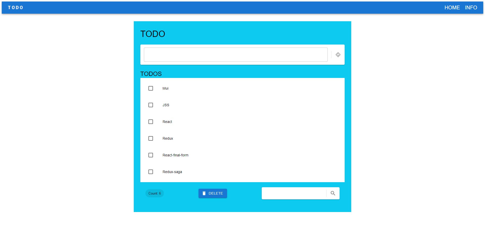

# To Do App
Todo-MUI is a simple todo application built using React, Redux, and Material-UI (MUI). It allows users to add, check off, filter, and clear todo items.

### Features

- **Add Todo Items**: Users can add new todo items by entering text in the input field and clicking the submit button.
- **Check Off Items**: Todo items can be checked off, moving them to the bottom of the list.
- **Filtering**: Users can filter todo items by entering text in the search input field. Only items containing the entered text will be displayed.
- **Clear Filter**: Users can clear the filter and display all todo items.
- **Delete All Items**: Users can delete all todo items with the click of a button.
- **Display Item Count**: The footer displays the total count of todo items.

### Technologies Used

- **React**: A JavaScript library for building user interfaces.
- **Redux**: A predictable state container for managing application state.
- **Material-UI (MUI)**: A popular React UI framework for building beautiful web applications.
- **React Router**: A library for declarative routing in React applications.
- **React Final Form**: A form library for React that utilizes the final form pattern.
- **@reduxjs/toolkit**: An official, opinionated, batteries-included toolset for efficient Redux development.

### Demo
Live view by clicking the link: https://todo-olha-sashchuk.netlify.app/

You can also clone the project and open it in localhost, or enjoy the preview video below instead

### Getting Started

To run Todo-MUI locally, follow these steps:
1. Clone the repo: git clone https://github.com/olhasashchuk/todo_graduate_project.git
2. Install dependencies using `npm install`
3. Start the development server using `npm run dev` 
4. The dev server will start on http://localhost:5173 to view the application.

### Contributing

Contributions are welcome! If you find any bugs or have suggestions for improvements, please open an issue or submit a pull request.
